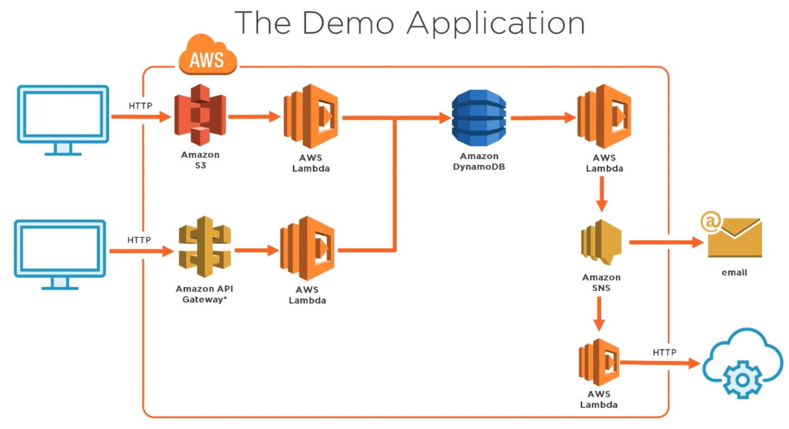

# AWS Developer: Lambda Deep Dive

https://app.pluralsight.com/library/courses/aws-developer-lambda-deep-dive

# Getting Started with AWS Lambda

## Introducing AWS Lambda

- Serverless
- Small, on-demand, event-driven applications (execution time < 5min)
- Supports Node.js, Python, Java, C# (.NET Core)

## Why use AWS Lambda?

- Eliminate server management overhead (FaaS - Function as a Service)
- Scalelable (automatically and continuously)
- Cost effective (pay as you go / pay for runtime)
- Always ready (availability and fault tolerant)

## AWS Lambda Costs

https://aws.amazon.com/lambda/pricing/

1M requests free per month, costs thereafter - see above link

## AWS Lambda Limits

https://docs.aws.amazon.com/lambda/latest/dg/limits.html

e.g. 5 minute execution, 250mb of code, 1000 concurrent executions

## Getting Started with AWS Lambda

Free tier - https://aws.amazon.com/free/

## Demo - Setting up a New AWS Account

- Root user for performing operations in AWS is a bad idea
- Create a user in IAM called 'Admin' with AWS Management Console Access
- Add to Admin Group (with policy AdministratorAccess)
- Download credentials and store securely

## AWS Identity and Access Management

- Create users, groups and assign security credentials
- Roles (permissions to entities or AWS services)
- Policies (define permissions of an identity or resource)

## Understanding IAM Policies

Policies are JSON objects, e.g.
```json
{
    "Version": "2012-10-17",
    "Statement": [
        {
            "Effect": "Allow",
            "Action": [
                "dynamodb:UpdateItem"
            ],
            "Resource": "arn:aws:dynamodb:*:*:*"
        }
    ]
}
```

Note the version is the version of the language the policy is written with (not the version of the specific policy)

https://docs.aws.amazon.com/IAM/latest/UserGuide/reference_policies_elements.html

## Demo - IAM Roles and Policies

- You can create a role (for a type of service e.g. Lambdas) and attach policies (including inline JSON)
- Create a role called `Lambda_readS3` with `AmazonS3ReadOnlyAccess`

## Overview of the Demo Application

Inventory management system:
- File upload to S3 to add inventory
- API call to add inventory
- Emails sent and another service called if an item about to run out of stock



# Writing and Deploying Your Lambda Functions

## Lambda Function Overview

Examples are in Python e.g.

```python
def handler_name(event, context)
    # insert code here
    return result;
```

- Return value is optional
- Parameters:
    - Event data (usually dict) in `event` parameter
    - Runtime information passed via the `context` parameter (e.g. remaining time allowed on Lambda in MS, AWS request ID)

## Creating a new AWS Lambda Function

3 options:
- Create from scratch
- Use existing blueprint
- Serverless application repository (pre-existing made by the serverless community)

## Demo - Creating DynamoDB Table

- Create table (table name `inventory`, primary key `product_id`)
- Ensure backups are enabled for the table - we will use a Lambda function to trigger an on-demand back-up

## Demo - Creating a new Lambda function

- Create a function `DynamoBackup` in C# (Node.js 12.x) with a custom `lambda_dynamodb_backup` role:

```json
{
    "Version": "2012-10-17",
    "Statement": [
        {
            "Effect": "Allow",
            "Action": [
                "logs:CreateLogGroup",
                "logs:CreateLogStream",
                "logs:PutLogEvents"
            ],
            "Resource": [
                "arn:aws:logs:*:*:*"
            ]
        },
        {
            "Effect": "Allow",
            "Action": [
                "dynamodb:CreateBackup"
            ],
            "Resource": "arn:aws:dynamodb:*:*:*"
        }
    ]
}
```

You can edit the code in-line:
```javascript
const AWS = require('aws-sdk');
const ddb = new AWS.DynamoDB({apiVersion: '2012-08-10'});
exports.handler = async (event, context) => {
    return new Promise((resolve, reject) => {
        ddb.createBackup({
            BackupName: 'MyAutomaticBackup',
            TableName: 'inventory'
        }, (err, data) => {
            if (err) {
                reject(err);
            }
            else {
                resolve(data);
            }
        });
    });
};
```

You can test by testing with an empty event (call it `MyEmptyEvent`) - you should see a backup has been created in DynamoDB.

## Uploading a Lambda Function

- Write code and save as file
- Package code file and dependencies in zip
- Upload using console or AWS CLI (https://aws.amazon.com/cli/) - you can replace `zip-file` with a S3 bucket location (`--code` paramter):

```cmd
aws lambda create-function \
--region us-east-2 \
--function-name MyNewLambda \
--zip-file c://my_package.zip \
--role arn:aws:iam::account-id:role/my_lambda-role \
-- handler hello_python.my_handler \
--runtime python3.6 \
--timeout 15 \
--memory-size 512
```

https://docs.aws.amazon.com/cli/latest/reference/lambda/create-function.html

## Introducing CloudWatch


